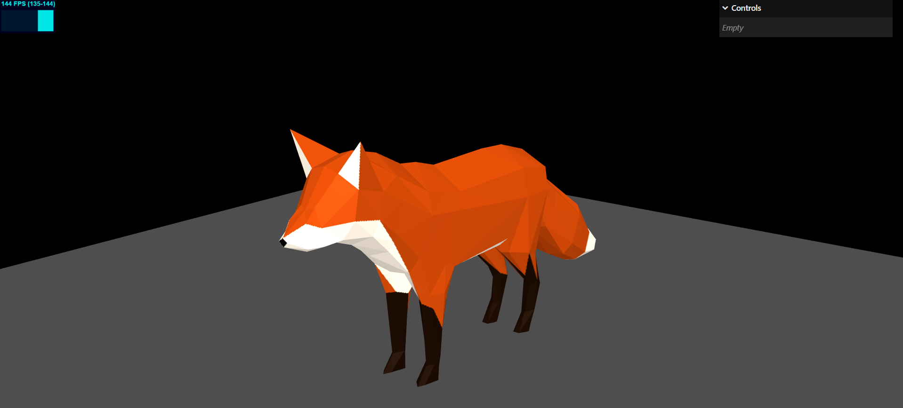

# Stan



Stan is a 3D game engine implemented in ES6 for learning purposes. It combines [Three.js](https://threejs.org/) for the WebGL rendering, [cannon-es](https://github.com/pmndrs/cannon-es) for the physics and a few of custom classes to handle several basic features in a game engine 

* Game loop
* Asset manager
* Bus event
* Colors
* Input (keyboard and mouse)
* Camera
* Meshes
* Materials
* Lights
* Shadows
* ECS
* Physics
* Animations

# Why Stan?

This engine is named after Smilin' Stan S. Stanman, the hillarious character in the [Monkey Island](https://es.wikipedia.org/wiki/Monkey_Island) series.


# Usage

This project uses NPM to handle Node dependencies and [Vite](https://vitejs.dev/) to serve the files. Just open the terminel and type

```
# Install dependencies
npm install

# Start webserver
npm run dev
```

Then go to localhost and open any of the examples depicted in the `examples` folder:

```
http://localhost:5173/gameloop.html
http://localhost:5173/asset-manager.html
http://localhost:5173/model.html
```

# Models & Textures

This project uses some models from the official [glTF Sample Models repository](https://github.com/KhronosGroup/glTF-Sample-Models) and textures from https://3dtextures.me/2019/04/16/door-wood-001/.
